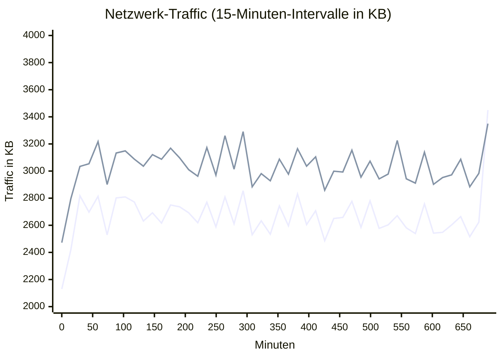

```mermaid
xychart-beta
  title "Netzwerk-Traffic (15-Minuten-Intervalle in KB)"
  x-axis "Minuten" 0 --> 690
  y-axis "Traffic in KB" 2000 --> 4000
  line [2130, 2419, 2818, 2697, 2814, 2529, 2802, 2809, 2772, 2631, 2692, 2616, 2750, 2736, 2692, 2619, 2770, 2588, 2809, 2611, 2855, 2530, 2633, 2534, 2743, 2596, 2831, 2605, 2707, 2486, 2650, 2658, 2777, 2585, 2780, 2577, 2603, 2671, 2581, 2539, 2758, 2542, 2548, 2603, 2664, 2516, 2623, 3450]
  line [2472, 2796, 3034, 3054, 3217, 2901, 3133, 3149, 3088, 3036, 3121, 3087, 3169, 3097, 3010, 2962, 3173, 2970, 3261, 3014, 3291, 2884, 2981, 2928, 3088, 2977, 3165, 3036, 3105, 2859, 2999, 2993, 3154, 2955, 3073, 2942, 2978, 3226, 2943, 2911, 3139, 2902, 2952, 2972, 3087, 2884, 2983, 3350]
```
